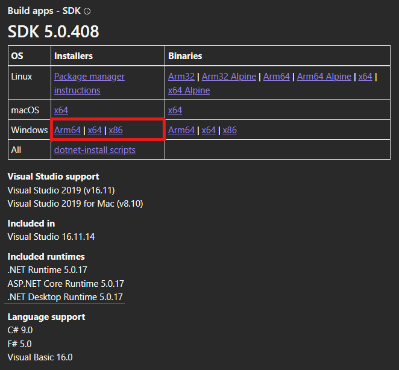
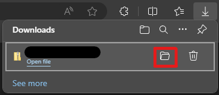

# Sriap (But Forms)

This is a simple pairs game application, built in the windows forms C# framework.
.krowemarf #C smrof swodniw eht ni tliub ,noitacilppa emag sriap elpmis a si sihT

## Contents

- [Installation](#installation)
  - [.NET](#net)
    - [.NET Installer](#net-installer)
    - [Windows Package Manager (WinGet)](#windows-package-manager-winget)
    - [PowerShell](#powershell)
- [Credits](#credits)
- [Copyright and Licensing?](#copyright-and-licensing)
- [Logo](#logo)

---

## Installation

You can find the releases page here: <https://github.com/Frank-Hudson/sriap-but-forms/releases>.

### .NET

For this application, you will need either the .NET Desktop Runtime, or the .NET SDK.

There are 3 main ways to do this for a user:[^1]

- With [the .NET Installer](#net-installer)  
  &emsp; Executable installer (double-click). Installs system-wide.
- With [the Windows Package Manager (WinGet)](#windows-package-manager-winget)  
  &emsp; Manage .NET through the commandline. Installs system-wide.
- Or with [PowerShell](#powershell).  
  &emsp; Automate install. Choose version easily.

#### .NET Installer

If you are a casual user, this will be the best and easiest choice for you as it only needs you to run the .NET installer from downloaded from Microsoft's .NET website - <https://dotnet.microsoft.com/en-us/download/dotnet>.

> \[Just FYI]  
> So that I don't waste your time, this method requires elevated permissions (Admin privaleges) in order to install.

1. Go to <https://dotnet.microsoft.com/en-us/download/dotnet>
2. Select version 5.0 of .NET, as shown below  
   
3. Choose either the SDK or the .NET Desktop Runtime  
     
   
4. If there are multiple OS choices, such as Linux, MacOS, Windows and so on, choose Windows  
     
5. Under the **Installers** column, choose the correct architecture for you machine (Arm64, x64 or x86) and download the respective installer by clicking the relevant link  
     
     
   &emsp; If you are unsure of your computer's architecture, on Windows 10 (and probably similar on 7, 8 and 11) you can open **Settings** > **System** > **About** > **Device specifications** > **System type** and it should tell you there what architecture your computer has  
     
   If you are still uncertain after this, you can either look up how to find your architecture online, or just go with x64, as it is the most common  
   &emsp; Of course, if that doesn't work you could try trial and error with the other 2  
7. Once you have downloaded the relevant executable, either open Windows Explorer and navigate to where the file was saved (this will most likely be your **Downloads** folder, unless you changed the location yourself), or, find your list of downloads on your browser and select the folder icon next to the .NET installer file to open the Explorer from there  
     
   Some browsers, like Microsoft Edge by default, might require a more convoluted approach - requiring you open the ellipse ( &ctdot; / &vellip; ) menu before selecting **Downloads** there  
     
     
     
8. When you have located the executable, run it by double-clicking. The Windows Installer dialogue will appear  
     
9. If you agree to the terms, click `🛡️Install` and follow the instructions until .NET is installed  

#### Windows Package Manager (WinGet)

#### PowerShell

## Credits

- Frank Hudson (Author, Me)
- Coleg y Cymoedd (The college I was at when I made this (for an assignment))

## Copyright and Licensing

There is No Copyright or License on this product.

## Logo

[^1]: https://learn.microsoft.com/en-us/dotnet/core/install/windows
